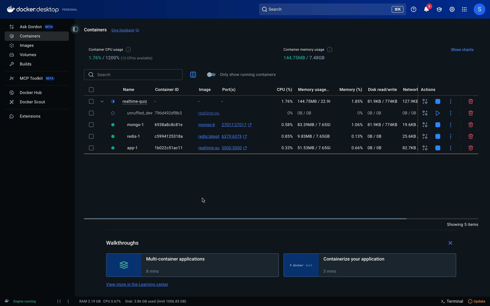
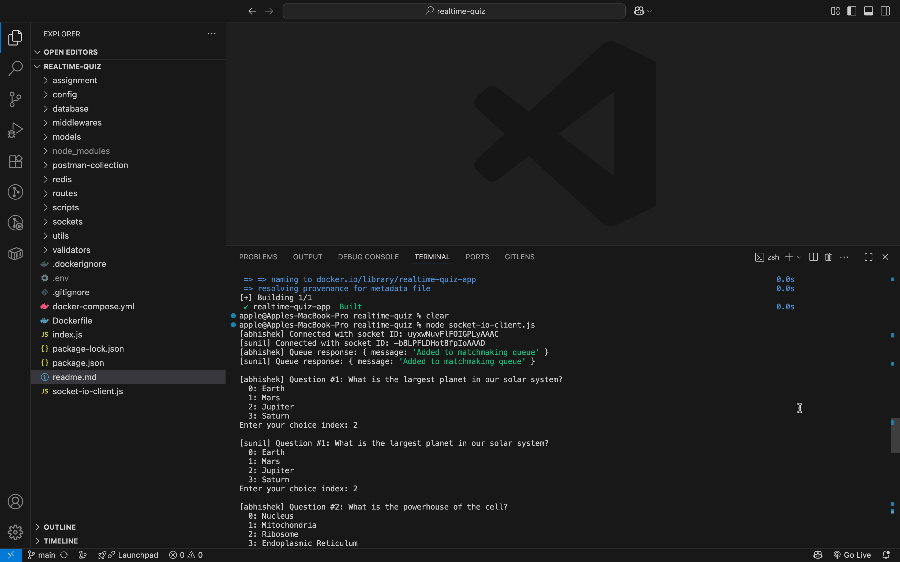
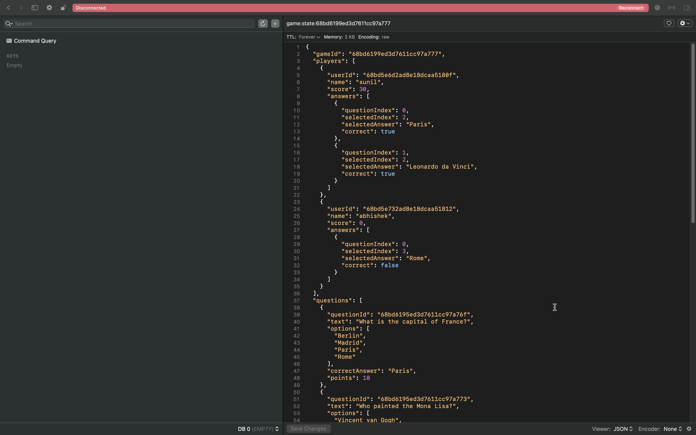
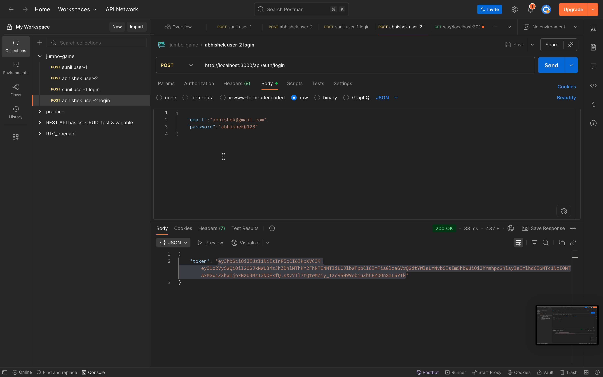
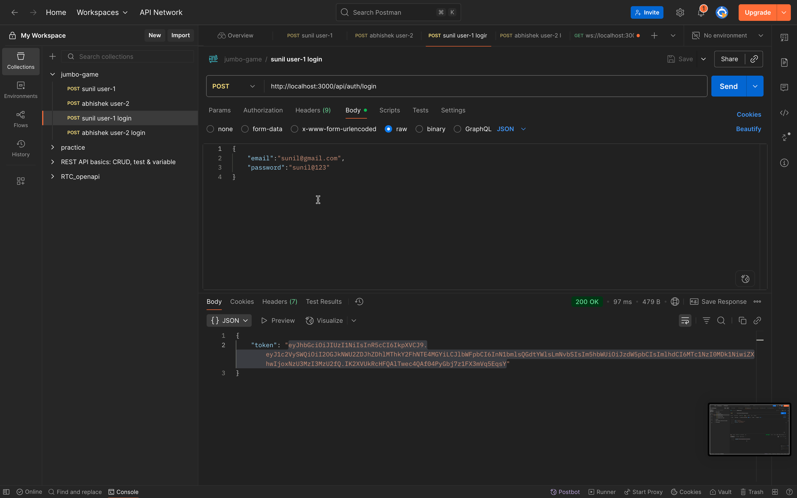
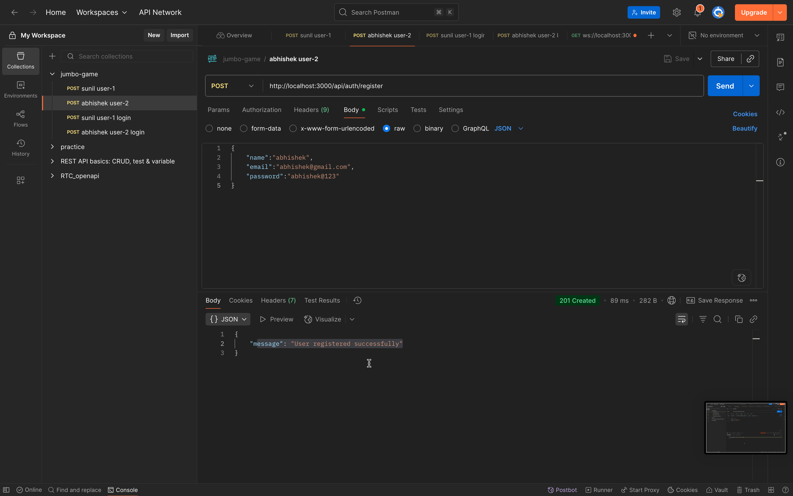
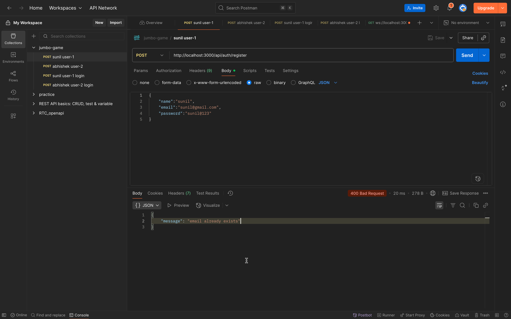
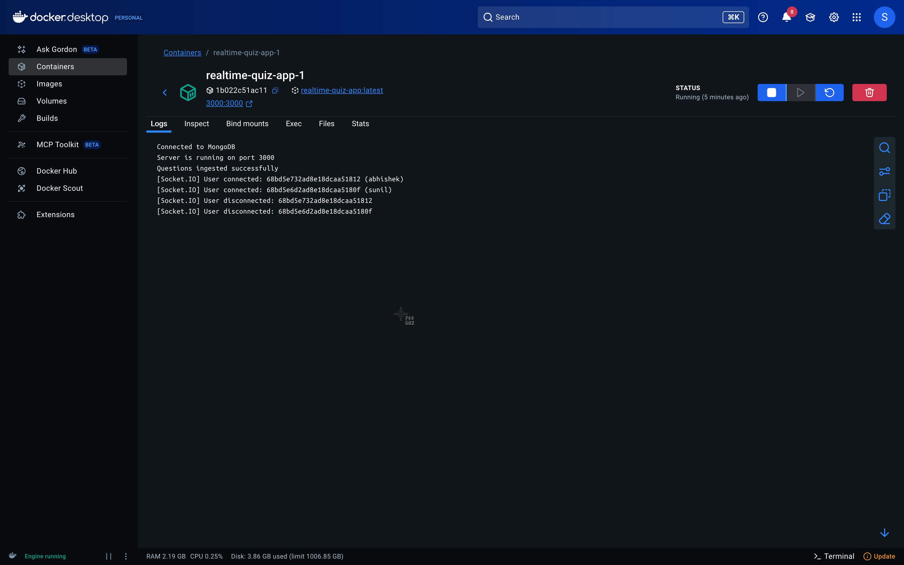
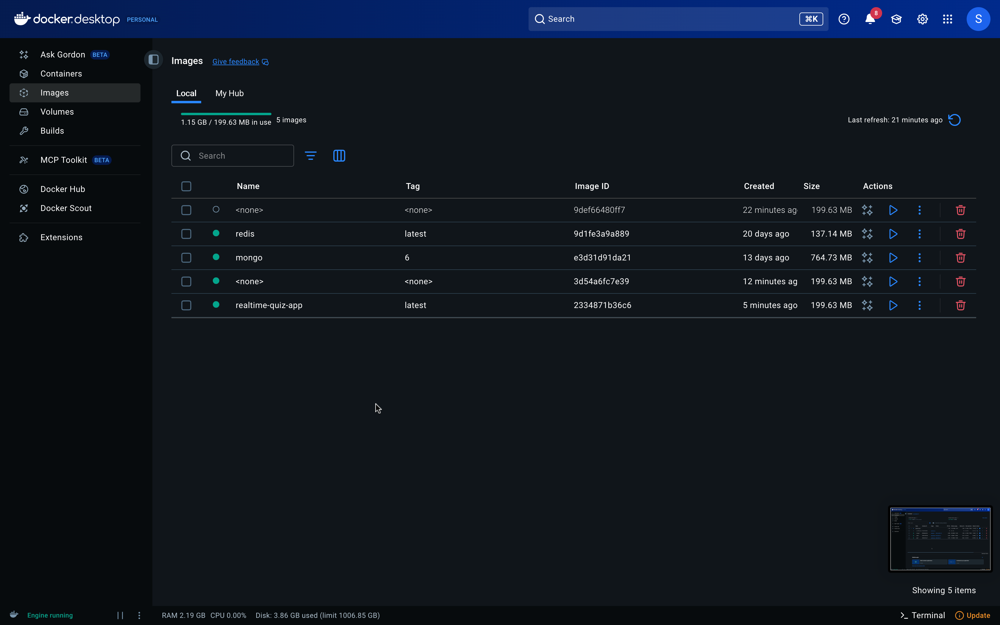

# 🕹️ Realtime Quiz App

A **Node.js + Socket.IO + MongoDB + Redis ( Pub-Sub )** powered multiplayer quiz application where users can join, answer questions in real-time, and compete for the highest score.

---

## 🚀 Features

- 🔐 JWT Authentication (Login with name + email)
- 🎮 Matchmaking Queue (players get paired automatically)
- ❓ Random Questions (sampled from MongoDB)
- 📡 Real-time Question & Answer flow using **Socket.IO**
- 🏆 Winner calculation based on score
- 🐳 Docker Compose support for easy setup

## 🛠️ Setup

### 1️⃣ Clone & Install

```bash
git clone https://github.com/yourname/realtime-quiz.git
cd realtime-quiz
npm install

```

## Environment Variables

## Create .env file:

- MONGO_URI=mongodb://localhost:27017/quiz
- JWT_SECRET=replace-this-secret
- NUM_QUESTIONS=6
- PORT=3000
- REDIS_HOST=127.0.0.1
- REDIS_PORT=6379

### Run Locally

```bash
node index    # Start Express + Socket.IO
node socket-io-client.  # client socket

```

## Run using Docker compose Build

```bash
1.docker compose build
2.docker compose up -d

3.node socket-io-client


```

## End Points

```bash

| Method | Endpoint             | Description                                              |
| ------ | -------------------- | -------------------------------------------------------- |
| POST   | `/api/auth/register` | Register new user with `{email, name, password}`                   |
| POST   | `/api/auth/login`    | Login with `{email, password}` → returns JWT                 |
| POST   | `/api/game/start`    | Join matchmaking queue (Authorization: Bearer `<token>`) |

```

## After Login, insert generated token in tokens array inside socket-io.client.js file.

## Socket.IO Events

```bash

| Event           | Direction       | Payload Example                                                                                                         |
| --------------- | --------------- | ----------------------------------------------------------------------------------------------------------------------- |
| `question:send` | server → client | `{ "gameId": "123", "questionIndex": 0, "question": { "questionText": "What is 2+2?", "options": ["1","2","3","4"] } }` |
| `answer:submit` | client → server | `{ "gameId": "123", "questionIndex": 0, "selectedChoice": 3 }`                                                          |
| `game:end`      | server → client | `{ "players": [{ "userId": "u1", "name": "Alice", "score": 50 }], "winner": "Alice" }`                                  |

```

## Postman collections provided in postman-collection folder










